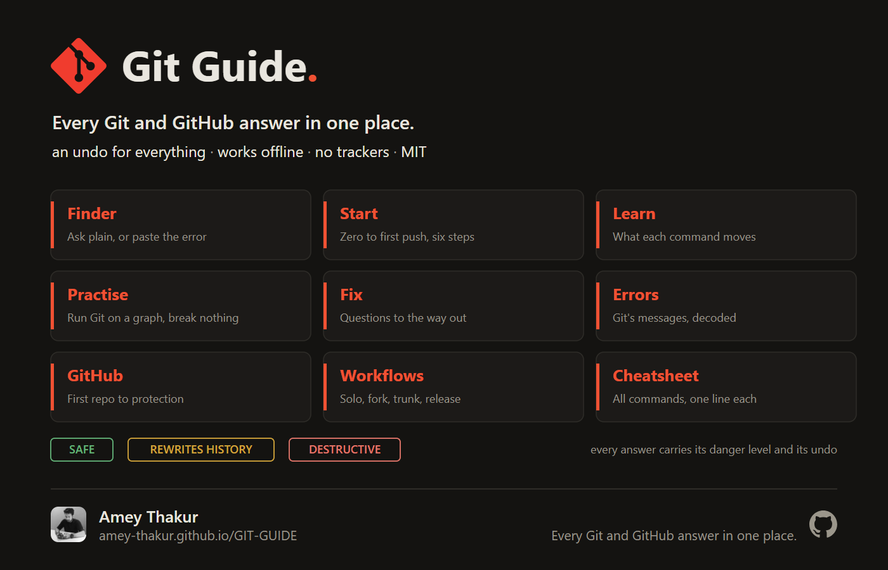
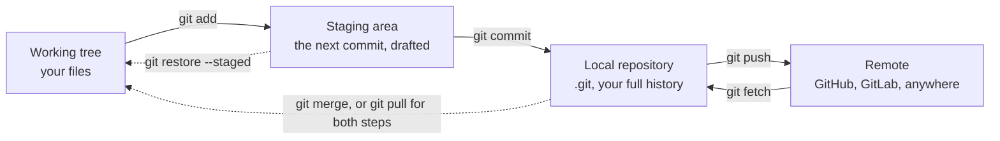
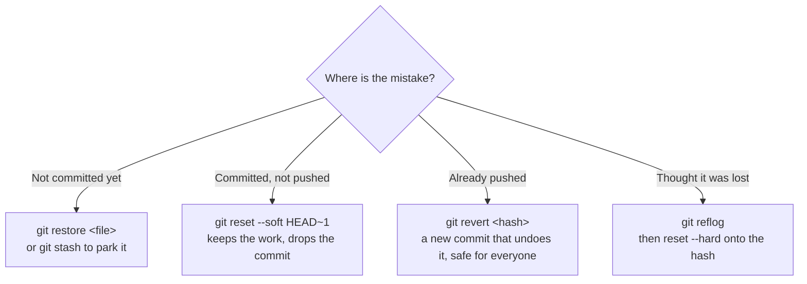
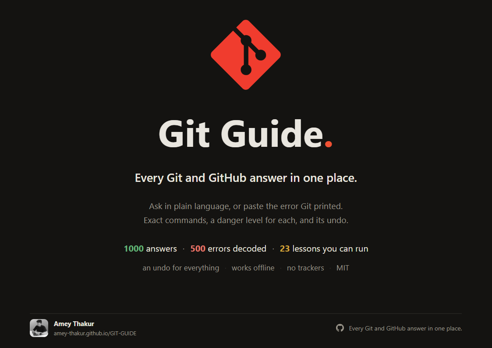
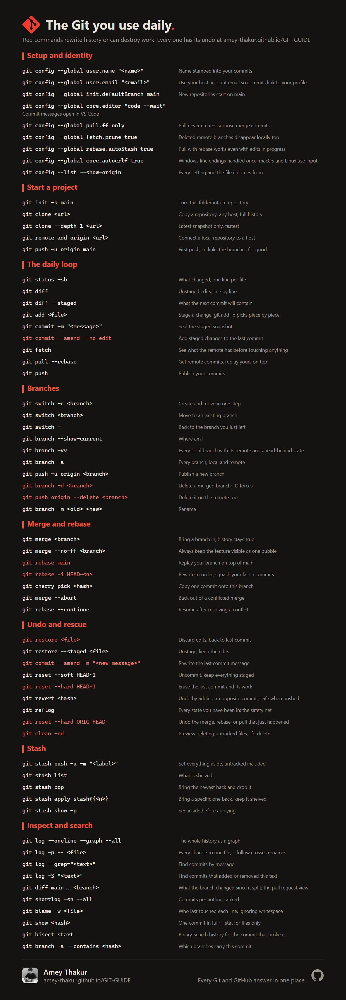
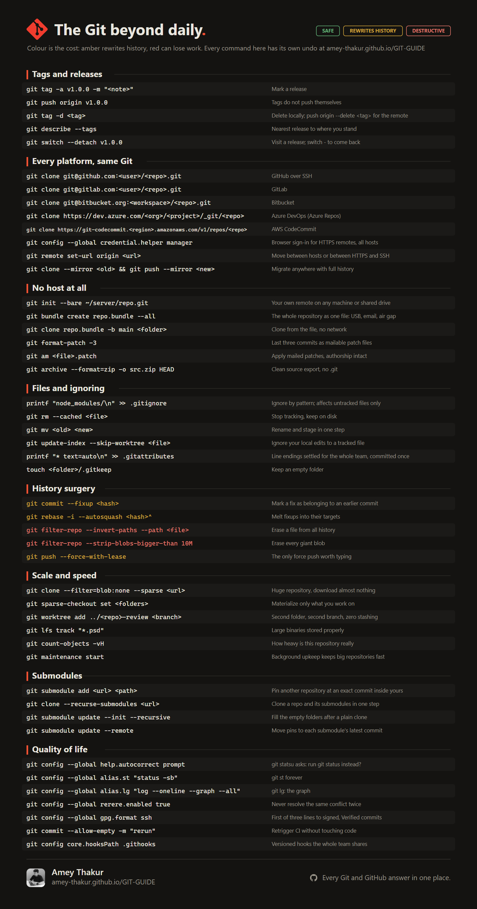

# Git Guide

**Every Git and GitHub answer in one place.**

Type what you want to do. Get the exact commands, what each one does,
how dangerous it is, and how to undo it.

**[Open Git Guide](https://amey-thakur.github.io/GIT-GUIDE/)** · **[Download the PDF](https://amey-thakur.github.io/GIT-GUIDE/assets/git-guide.pdf)** · **[Ask a question](https://github.com/Amey-Thakur/GIT-GUIDE/discussions)**

  

 

## Why this exists

Four of the ten highest-voted questions on all of Stack Overflow are Git questions. The top thirty alone have been read about 180 million times. People do not struggle to find Git tutorials; they struggle to find the right command at the moment they need it, and to know whether running it is safe.

This guide answers that, for everyone from a student's first push to an engineer rewriting history.

 

## The whole model, in one diagram

Almost every Git command is movement between four places. Learn the four, and the commands stop needing memorising.

And when something has gone wrong, the question is only ever how far the mistake has travelled.

> [!TIP]
> You can run every one of these against a real commit graph, with nothing at stake, in the **[sandbox](https://amey-thakur.github.io/GIT-GUIDE/play.html)**.

 

## How to use it

1. Open **[Git Guide](https://amey-thakur.github.io/GIT-GUIDE/)**.
2. Type what you want in plain language: `undo the last commit`, `gitignore not working`, `permission denied publickey`.
3. Copy the command with one click.

> [!TIP]
> Press <kbd>/</kbd> anywhere on the site to jump straight to the search box. Every answer has its own link, so you can send a teammate exactly the fix they need.

 

## Inside the guide

| Page | What it does |
| --- | --- |
| [Finder](https://amey-thakur.github.io/GIT-GUIDE/) | Ask anything in plain language, or paste an error. Copy the answer. |
| [Start](https://amey-thakur.github.io/GIT-GUIDE/setup.html) | Zero to first push in six ordered steps. |
| [Learn](https://amey-thakur.github.io/GIT-GUIDE/learn.html) | Interactive diagrams: where code lives, what each command moves, branches and HEAD. |
| [Practise](https://amey-thakur.github.io/GIT-GUIDE/play.html) | A real Git engine in the page. Twenty-three lessons, a conflict with real markers to delete, and a timed drill that destroys three commits so you can bring them back. |
| [Fix](https://amey-thakur.github.io/GIT-GUIDE/fix.html) | A few questions, then the exact way out of any mess. |
| [Errors](https://amey-thakur.github.io/GIT-GUIDE/errors.html) | Git's real error messages, decoded, with fixes. |
| [GitHub](https://amey-thakur.github.io/GIT-GUIDE/github.html) | Pull requests, forks, Actions, releases, Pages, and the power moves, with the PR lifecycle as an interactive diagram. |
| [Workflows](https://amey-thakur.github.io/GIT-GUIDE/workflows.html) | How individuals and teams actually run Git, solo to trunk-based. |
| [Cheatsheet](https://amey-thakur.github.io/GIT-GUIDE/cheatsheet.html) | Every command worth knowing, one line each, danger-marked. |
| [Answers](https://amey-thakur.github.io/GIT-GUIDE/answers.html) | All thousand, as plain HTML with no JavaScript needed. Filter by what a command can cost you. |

 

## Read the badge before you run the command

Every answer carries one of three danger levels.

| Badge | Meaning |
| --- | --- |
| `Safe` | Changes nothing you cannot get back |
| `Rewrites history` | Coordinate before doing this to shared branches |
| `Destructive` | Can lose work permanently |

> [!WARNING]
> Commands marked `Destructive` can erase work forever. The guide always states the escape route, or the absence of one, before you run the command, never after.

 

## What makes it different

- **An undo for every command.** Where no undo exists, it says so up front.
- **Current Git, not 2015 Git.** `git switch` and `git restore` first, `--force-with-lease` instead of `--force`.
- **Real situations, not abstract syntax.** Answers split by the case you are in: not pushed, already pushed, teammates have it.
- **Somewhere to practise.** A working Git engine in the browser: branch, merge, rebase, and recover a commit you thought you had destroyed, on a graph that redraws as you type.
- **No dependencies, no ads, no tracking.** The site makes zero external requests, so it loads instantly and works behind corporate proxies.
- **It genuinely works offline.** A service worker caches the finder and all 1000 answers on your first visit, so the guide opens on a plane, on a train, or on a machine with no network at all. It is installable as an app too.

> [!NOTE]
> Git is not GitHub. Everything here works the same on GitLab, Bitbucket, Azure DevOps, and AWS CodeCommit, and much of Git needs no host at all: patches by mail, repositories over USB, air-gapped machines. The guide covers that world too.

 

## Pass it on

Every answer and every decoded error has its own link, so when somebody asks a Git question you can send them the exact fix rather than the front page. [SHARE.md](SHARE.md) has those links, one-click share buttons, and copy you can paste as is.

 

## Ask, answer, build on it

Every answer on the site also lives in [Discussions](https://github.com/Amey-Thakur/GIT-GUIDE/discussions), where you can ask follow-ups or request answers that are missing. Real questions decide what gets added next.

The whole knowledge base is plain JSON, served raw, with an [llms.txt](docs/llms.txt) map for AI agents: [intents.json](docs/data/intents.json).

 

## Take it with you

Four things to keep. Click any one to open it. Each is generated from this repository's live data, so none of them can go out of date.

| | |
| :---: | :---: |
|  |  |
| **[The guide, as a PDF](https://amey-thakur.github.io/GIT-GUIDE/assets/git-guide.pdf)** 22 pages. The model, the cheat sheets, the undos, the errors worth knowing. Printable, and readable on a plane. | **[The poster](https://amey-thakur.github.io/GIT-GUIDE/assets/poster.png)** Nine doors and the three danger levels on one sheet. Made for a wall, a slide, or a lab. |
|  |  |
| **[The daily card](https://amey-thakur.github.io/GIT-GUIDE/assets/cheatsheet-card.png)** The commands you reach for every day, on one page. The one to pin up. | **[The beyond card](https://amey-thakur.github.io/GIT-GUIDE/assets/cheatsheet-card-2.png)** Everything past the daily: history surgery, submodules, scale, recovery. |

 

## How it is built

Plain HTML, CSS, and vanilla JavaScript; no framework, no build step for the site itself. Every answer lives in JSON under [docs/data](docs/data), a [small script](.github/scripts/build_pages.py) renders the static pages from it, and [CI](.github/workflows/checks.yml) fails any commit where a page disagrees with its data, an id collides, a cross-reference dangles, or house style slips.

 

## Author

**[Amey Thakur](https://github.com/Amey-Thakur)** · Everything in this guide is the Git I actually use. It is written the way I wish someone had shown me: the command, the risk, the way back.

 

 

## License

[MIT](LICENSE). The Git logo is by Jason Long (CC BY 3.0); Git and the GitHub mark are trademarks of their owners, used here only to identify the tools this guide documents.
